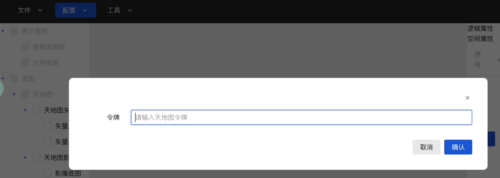
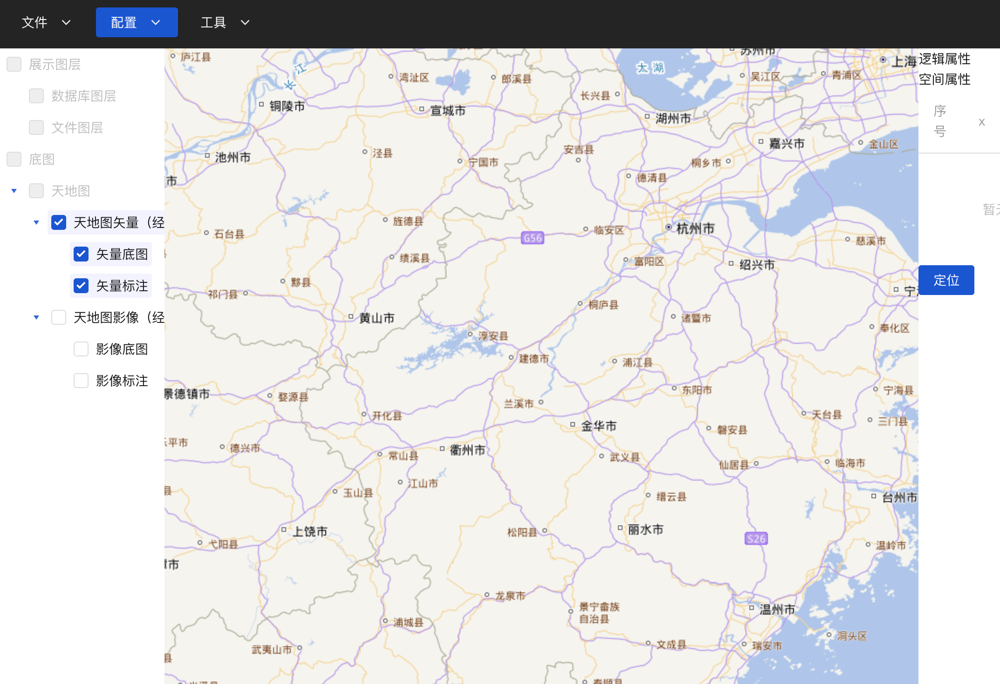

# 底图

## 天地图图层使用

1. 配置天地图的token，如果没哟天地图的token请在天地图[官网](https://www.tianditu.gov.cn/)申请
2. 申请完成后通过点击本软件的菜单: 配置 -> 天地图token，点击后界面如图所示

在令牌输入框中输入具体数据点击保存完成令牌配置

3.   点击图层树中的`天地图影像（经纬度投影）`可以看到如图所示内容

点击图层树中的`天地图矢量（经纬度投影））`可以看到如图所示内容

注意: **影像图的图层在矢量图之下**
